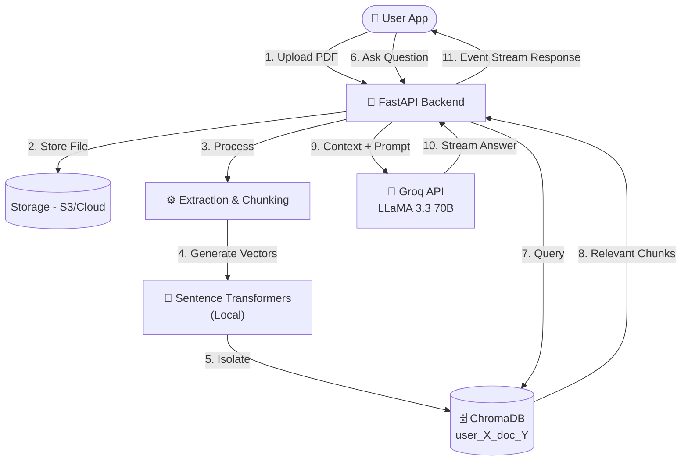

# 🧠 DocuMind AI — Secure Chat with Your Documents

[](https://github.com/AvishkaGihan/documind-ai/actions/workflows/backend-ci.yml)
[](https://github.com/AvishkaGihan/documind-ai/actions/workflows/mobile-ci.yml)
[](https://opensource.org/licenses/MIT)


*(Add your beautiful banner image above)*

## 📖 Overview
**DocuMind AI** is a secure, high-performance RAG (Retrieval-Augmented Generation) platform that allows users to upload PDFs and engage in contextual chat conversations. Designed with privacy first, it guarantees **strict user data isolation** for enterprise-grade safety, processing your documents with blazing fast LLaMA 3.3 inference.

## ✨ Features
- 🔒 **Secure Data Isolation**: ChromaDB collections partitioned per user/document pair.
- ⚡ **Lightning Fast Inference**: Powered by LLaMA 3.3 70B on the Groq API.
- 📈 **Zero API Cost Embedded Search**: Uses local `Sentence-Transformers` for generating vector embeddings offline.
- 🔗 **Citation Tracing**: Every AI answer includes clickable source page references for full transparency.
- 📱 **Cross-Platform Mobile Application**: Beautiful, responsive Material 3 experience built with Flutter and Riverpod.

## 🛠️ Tech Stack

### Frontend (Mobile)
- **Flutter** 3.41 (Dart 3.x)
- **State Management**: Riverpod (`AsyncNotifier`) / Immutable State (`@freezed`)
- **Networking**: Dio with interceptors
- **Storage**: `flutter_secure_storage`

### Backend (API)
- **Python** 3.12+ / FastAPI
- **ORM**: SQLAlchemy 2.0 (asyncpg) / Alembic
- **Validation**: Pydantic v2
- **Database**: SQLite (Dev) / PostgreSQL 16 (Prod)

### AI / ML Infrastructure
- **LangChain** orchestrating RAG nodes
- **Embeddings**: `sentence-transformers` (Local)
- **Vector Database**: ChromaDB (Isolated Collections)
- **Inference Provider**: Groq API 

## 📸 Screenshots

| Login & Auth | Home & Library | Chat Interface |
| :---: | :---: | :---: |
|  |  |  |

| Document Citations | Settings |
| :---: | :---: |
|  |  |


## 📐 Architecture

Our architecture strictly enforces separation of concerns and physical vector isolation:




## 📂 Folder Structure

```text
documind-ai/
├── backend/            # Python FastAPI business logic and ML services
│   ├── app/            # Source code: routers, services, repositories
│   ├── alembic/        # Database migrations
│   └── tests/          # Unit and integration test suites
├── mobile/             # Flutter client application
│   ├── lib/            # Source code: features, shared widgets, core
│   └── test/           # Widget and logic tests
├── docs/               # Architecture diagrams and critical rules context
└── ...
```

## 🚀 Getting Started

### Prerequisites
- **Flutter SDK** (3.41+)
- **Python** (3.12+)
- **Groq API Key** (for LLaMA inference)

### Setup Instructions

1. **Clone the Repository:**
   ```bash
   git clone https://github.com/AvishkaGihan/documind-ai.git
   cd documind-ai
   ```

2. **Backend Setup:**
   ```bash
   cd backend
   python -m venv .venv
   source .venv/bin/activate
   pip install -r requirements.txt
   cp .env.example .env  # Add your Groq API Key
   python -m alembic upgrade head
   uvicorn app.main:app --reload --port 8000
   ```

3. **Mobile Setup:**
   ```bash
   cd ../mobile
   flutter pub get
   flutter run
   ```

## 💡 Usage
Once both the backend and mobile applications are running:
1. Create a secure account inside the mobile app.
2. Upload a PDF document directly through the library interface.
3. Tap on the document to enter the chat interface and start asking questions!
4. Tap on the generated citations to see exactly what pages the AI pulled its answers from.

## ⚙️ Configuration / Environment Variables

The backend relies on environmentally injected variables. See `backend/.env.example` for details. 
- `GROQ_API_KEY`: Required for LLaMA 3.3 LLM access.
- `DATABASE_URL`: URI for connecting to the PostgreSQL/SQLite database.

## 🔌 API

The backend uses FastAPI which automatically generates interactive OpenAPI documentation. 
When running locally, visit:
- **Swagger Docs**: `http://localhost:8000/docs`
- **ReDoc**: `http://localhost:8000/redoc`

All endpoints are strictly versionsed under `/api/v1/` and expect JWT tokens for authenticated operations.

## 🧪 Testing

Testing is strictly enforced across both stacks.
- **Backend**: `pytest` handles async-based unit testing and integration routes. Code coverage target is `>80%`.
- **Mobile**: `flutter test` checks Riverpod states and performs widget validation.

## ⏱️ Performance / Limitations

- **Speed Standards**: AI answers generate in `<5 seconds (p95)`. PDF Document processing runs at `<30 seconds` for a standard 50-page document.
- **Token Constraints**: Groq and LLaMA limits scale to the 128k context window constraints.
- **Rate Limiting**: Users are capped at 20 QA queries per minute and 100 uploads a day per user.

## 🧠 Technical Decisions

- **Why Flutter / Riverpod?**: Flutter offers peak cross-platform rendering capabilities. Riverpod handles our complex async operations beautifully without UI jank.
- **Why FastApi?**: The asynchronous native ecosystem aligns perfectly with high async-latency IO workloads such as LLM inference and SQL accesses.
- **Why Local Embeddings?**: By running `sentence-transformers` locally via Langchain, we zero out vectorization API costs which saves enormous long-term compute expenses.

## 🧗 Challenges & Solutions

**Challenge**: Maintaining absolute data isolation without creating too many physical servers.
**Solution**: Designed dynamic ChromaDB collection indexing based purely strings formatted as `user_{id}_doc_{id}`. This strictly isolates memory references for search without destroying multi-tenant scaling capabilities.

## 🔮 Future Improvements

- **Web Portal Expansion**: Expanding the Flutter application to Web formatting.
- **Local Model Switching**: Modifying the agent injection nodes to point at local Ollama instances rather than external APIs for ultimate privacy.
- **Background Pipeline Tasks**: Transitioning the API extraction node to a Celery worker mesh for better performance under high load.

## 🤝 Contributing
Contributions are welcome! Please examine our [Contributing Guidelines](CONTRIBUTING.md) and [Code of Conduct](CODE_OF_CONDUCT.md).

1. Fork the Project
2. Create your Feature Branch (`git checkout -b feature/AmazingFeature`)
3. Commit your Changes (`git commit -m 'feat: Add some AmazingFeature'`)
4. Push to the Branch (`git push origin feature/AmazingFeature`)
5. Open a Pull Request

## 📄 License
This project is licensed under the MIT License - see the [LICENSE](LICENSE) file for details.

## 📬 Author / Contact
**Avishka Gihan**
- GitHub: [@AvishkaGihan](https://github.com/AvishkaGihan)
- Project Link: [https://github.com/AvishkaGihan/documind-ai](https://github.com/AvishkaGihan/documind-ai)
