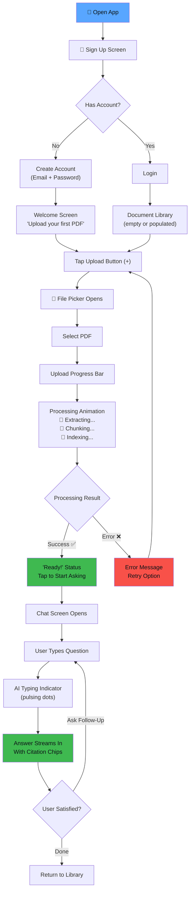
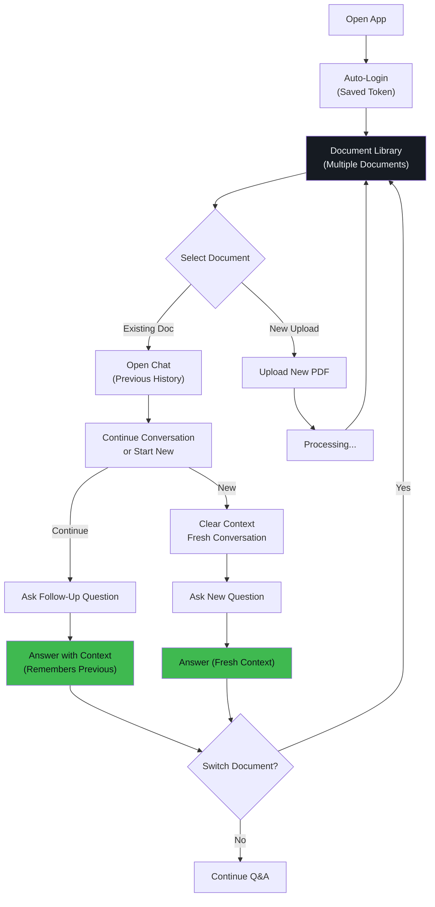
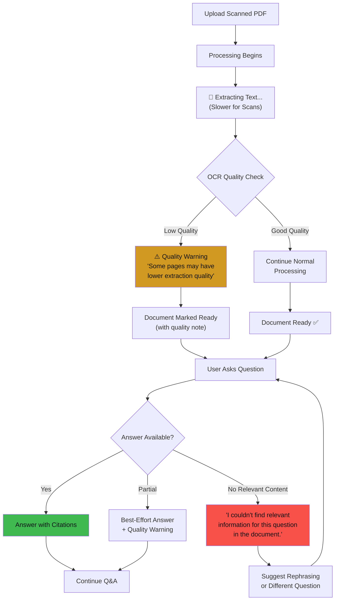

# UX Design Specification — DocuMind AI

**Author:** Avishka Gihan
**Date:** 2026-03-14

---

## Executive Summary

### Project Vision

DocuMind AI is a mobile-first intelligent document Q&A assistant that transforms how people interact with dense, complex PDFs. Instead of passively scrolling through contracts, research papers, or technical manuals, users engage in natural conversation with their documents — asking questions and receiving precise, cited answers grounded in the actual content with page-level references.

The UX vision is to make every interaction feel like having a **brilliant research assistant in your pocket** — one who has read every word of your document, remembers every detail, and can instantly point you to the exact page. The interface should feel alive, intelligent, and trustworthy — never generic or tool-like.

### Target Users

**Priya — "The Graduate Researcher" (Primary)**
A 24-year-old Master's student who reads 10–15 papers weekly. She commutes 45 minutes each way and needs to extract specific methodologies, statistics, and references from dozens of PDFs — on her phone.

- **Context:** Typing on a moving train, scanning quickly, needs confidence in accuracy
- **Emotional need:** "I feel smart and thorough — my advisor is impressed"
- **UX implication:** Fast answers, clear citations, effortless follow-ups, thumb-friendly UI

**Daniel — "The Freelance Consultant" (Primary)**
A 31-year-old strategy consultant who reviews 20–40 page contracts from coffee shops. Works from phone and tablet, needs to quickly identify key terms, liability caps, and payment schedules.

- **Context:** Time-pressured, often in noisy environments, needs to scan critical info fast
- **Emotional need:** "I'm on top of every detail — nothing slips through"
- **UX implication:** Fast document processing, clear status feedback, confident error handling

**Alex — "The Self-Taught Developer" (Primary)**
A 27-year-old developer who reads official docs (200+ pages) instead of blog summaries. Needs specific code examples, configuration details, and method signatures.

- **Context:** Late-night debugging, switching between docs, needs exact answers
- **Emotional need:** "I have a personal documentation assistant"
- **UX implication:** Code-aware formatting, context isolation between docs, persistent library

### Key Design Challenges

1. **Trust Through Transparency:** Users must believe the AI's answers are accurate. Generic chatbot aesthetics will undermine trust. Every response needs visible citation anchoring.
2. **Mobile-First Chat Complexity:** Chat interfaces on mobile are familiar (WhatsApp, iMessage) but DocuMind adds document context, citations, and document switching — these must feel natural, not overwhelming.
3. **Processing Wait States:** Document upload → text extraction → chunking → embedding → indexing creates processing delays. These must feel productive and informative, not frustrating.
4. **Multi-Document Context Management:** Users switch between documents, each with its own conversation. This must feel seamless, not confusing.
5. **Information Density Balance:** Cited answers with page references contain more data than typical chat bubbles. The layout must handle this without feeling cluttered.

### Design Opportunities

1. **Citation as Delight:** Page references aren't just functional — they can be the primary trust-building and "wow" moment. Visual citation chips with page numbers create immediate credibility.
2. **Intelligent Processing Animations:** Transform wait states into moments of fascination — showing the AI "reading" and "understanding" the document creates engagement rather than impatience.
3. **Document Intelligence Dashboard:** The document library isn't just a file list — it can surface insights about what the user has explored, unanswered questions, and document relationships.
4. **Conversational Flow Design:** Follow-up questions are a core differentiator. The UI should actively encourage and facilitate natural conversational depth.

---

## Core User Experience

### Defining Experience

**"Upload a PDF, ask a question, get a cited answer in seconds."**

This is DocuMind AI's equivalent of Tinder's "swipe to match" — the single interaction that defines the product. If we nail the moment where a user asks their first question and receives an accurate answer with a page citation in under 5 seconds, everything else follows. That moment creates the "this actually works!" reaction that drives adoption, word-of-mouth, and portfolio impact.

### Platform Strategy

| Attribute | Decision |
|---|---|
| **Primary Platform** | Mobile (iOS 15+ & Android 12+) |
| **Framework** | Flutter (preferred) / React Native |
| **Orientation** | Portrait-primary; landscape optional for chat |
| **Input Method** | Touch-first; on-screen keyboard for Q&A |
| **Screen Minimum** | 4.7" (iPhone SE form factor) |
| **Offline Support** | Cached library + chat history; Q&A requires network |

**Mobile-first design principles:**
- Bottom-anchored navigation for thumb reachability
- Large touch targets (minimum 44×44pt)
- Single-hand operability for core flows
- Keyboard-aware layouts that don't obscure content
- Edge-to-edge design with safe area respect

### Effortless Interactions

| Interaction | Should Feel... | Design Approach |
|---|---|---|
| Uploading a PDF | As easy as sharing a photo | Native file picker → single tap → done |
| Asking a question | Like texting a friend | Familiar chat input bar at bottom |
| Reading an answer | Like reading a trusted source | Clean typography, highlighted citations |
| Following up | Completely natural | No context re-entry needed; just type |
| Switching documents | Like switching chat threads | Document selector in navigation |
| Finding past conversations | Instantaneous | Persistent per-document chat history |

### Critical Success Moments

1. **First Question Answered (Aha! Moment):** The user asks their first question and sees an accurate answer with "According to page 4…" — this is the moment that sells the product.
2. **Follow-Up Works Naturally:** User asks a follow-up without re-stating context, and the AI understands perfectly — this proves conversational intelligence.
3. **Document Processing Complete:** The transition from "processing" to "ready" should feel rewarding, not just functional.
4. **Multi-Document Switch:** Switching from one document's conversation to another without context bleed proves reliability.
5. **Long Document Success:** Getting accurate answers from a 200+ page document proves the technology works at scale.

### Experience Principles

1. **Trust Through Evidence:** Every AI response must visually demonstrate its grounding in actual document content. Citations are not metadata — they are the product.
2. **Conversational Intelligence:** The interface should feel like talking to a knowledgeable colleague, not operating a search tool. Follow-ups, context, and natural language are core.
3. **Mobile-Native, Not Mobile-Adapted:** This isn't a desktop app squeezed into a phone. Every interaction is designed for thumbs, commutes, and quick glances.
4. **Progressive Revelation:** Start simple, reveal depth. The first experience is "upload → ask → answer." Power features (document library, conversation history) emerge as the user grows.
5. **Transparency Over Magic:** Show the user what the AI is doing. Processing states, citation sources, confidence indicators — transparency builds trust.

---

## Desired Emotional Response

### Primary Emotional Goals

| Emotion | When It Should Arise | Design Approach |
|---|---|---|
| **Confidence** | When reading a cited answer | Bold page reference chips, clean source attribution |
| **Empowerment** | After getting a complex answer in seconds | Speed indicators, success micro-animations |
| **Intelligence** | When follow-up questions work naturally | Smooth conversational flow, context indicators |
| **Relief** | When a 40-page contract is instantly searchable | Processing complete celebration, "ready" state |
| **Delight** | When the answer is more precise than expected | Subtle confetti or glow on exceptionally good answers |

### Emotional Journey Mapping

```
Discovery → "This looks professional and trustworthy"
   ↓
Onboarding → "This is simple — I can do this"
   ↓
First Upload → "It's working — I can see it processing"
   ↓
First Question → "WOW — it actually knows the answer AND shows me the page!"
   ↓
Follow-Up → "It remembers what I just asked — this is smart"
   ↓
Deep Use → "I can't imagine going back to Ctrl+F"
   ↓
Return Visit → "My documents are right where I left them"
```

### Micro-Emotions

- **Confidence > Confusion:** Clear visual hierarchy, consistent patterns, never leave the user guessing what to do next
- **Trust > Skepticism:** Every answer shows its evidence. No black-box responses.
- **Accomplishment > Frustration:** Clear success states, progress indicators, positive feedback loops
- **Delight > Satisfaction:** Micro-animations, smooth transitions, moments of "this is well-made"
- **Focus > Overwhelm:** Progressive disclosure, clean layouts, information density managed carefully

### Design Implications

| Emotional Goal | UX Design Approach |
|---|---|
| Confidence | Citation chips are prominent, not footnotes. Page numbers are bold, tappable, visually distinct. |
| Empowerment | Speed is visible — show how fast the answer arrived. Success animations celebrate accomplishment. |
| Trust | Processing states show what's happening ("Extracting text…", "Building index…"). No mysterious spinners. |
| Delight | Smooth page transitions, spring animations on chat bubbles, subtle parallax on document cards. |
| Focus | Dark mode default (deep concentration), minimal chrome, content-first layouts. |

### Emotional Design Principles

1. **Earned Trust:** Trust is built incrementally — first through visual polish, then through accurate citations, then through consistent reliability. Never assume trust.
2. **Intelligent Feedback:** Every action has a response. Uploads show progress. Questions show typing indicators. Answers animate in with source citations.
3. **Calm Confidence:** The UI should feel calm and assured, not flashy or anxious. Deep blues, clean typography, generous spacing.
4. **Celebration of Success:** When the system works well (accurate answer, fast processing), subtly celebrate. When it struggles (low-quality scan, rate limit), communicate honestly.

---

## UX Pattern Analysis & Inspiration

### Inspiring Products Analysis

**1. ChatGPT (OpenAI)**
- **What it does well:** Streaming text responses, conversational UI, clean chat interface
- **Key UX pattern:** Progressive text rendering gives the feeling of a thoughtful, real-time response
- **Transferable insight:** Streaming answer display creates engagement during wait times

**2. Notion**
- **What it does well:** Document management, clean information hierarchy, smooth navigation
- **Key UX pattern:** Sidebar navigation with nested content, inline editing, beautiful typography
- **Transferable insight:** Document library organization and visual hierarchy principles

**3. Google Lens / Google Translate (Camera)**
- **What it does well:** Processing visual content with real-time feedback, clear result display
- **Key UX pattern:** Upload → Process → Result with visible intermediate states
- **Transferable insight:** Document processing feedback with informative intermediate states

**4. iMessage / WhatsApp**
- **What it does well:** Familiar chat interaction, smooth animations, keyboard handling
- **Key UX pattern:** Bottom-anchored input, message bubbles, typing indicators, auto-scroll
- **Transferable insight:** Chat interface patterns that feel native on mobile

**5. Arc Browser (The Browser Company)**
- **What it does well:** Premium feel, innovative navigation, beautiful dark mode
- **Key UX pattern:** Glassmorphism, vibrant accent colors on dark backgrounds, smooth animations
- **Transferable insight:** Premium dark-mode aesthetic that feels modern and polished

### Transferable UX Patterns

**Navigation Patterns:**
- **Bottom tab bar** (iMessage pattern) for primary navigation between Chat, Library, and Profile
- **Document selector** within chat (Notion-style sidebar or bottom sheet) for document switching
- **Pull-to-refresh** for document library status updates

**Interaction Patterns:**
- **Streaming text** (ChatGPT pattern) for progressive answer rendering
- **Typing indicator** (iMessage pattern) before AI response begins
- **Long-press context menu** for message actions (copy, share citation)
- **Swipe gestures** for conversation management (delete, new conversation)

**Visual Patterns:**
- **Glassmorphism cards** (Arc Browser pattern) for document library items
- **Gradient accents** for citation chips and interactive elements
- **Skeleton loading** for content that's loading
- **Micro-animations** on state transitions (processing → ready, question → answer)

### Anti-Patterns to Avoid

| Anti-Pattern | Why It's Harmful | Our Alternative |
|---|---|---|
| Generic spinner with no context | Creates anxiety, user doesn't know if it's working | Descriptive processing stages with progress |
| Wall of text answers | Overwhelms on mobile, destroys scannability | Structured answers with highlighted citations |
| Hidden or footnote-style citations | Undermines the core value proposition | Prominent inline citation chips |
| Desktop-first layouts on mobile | Feels cramped, tap targets too small | Mobile-native component sizing |
| Jarring page transitions | Feels cheap and unpolished | Spring-based, 60fps smooth transitions |
| Generic Material Design defaults | Looks like every other Flutter app | Custom design language with unique identity |

### Design Inspiration Strategy

**What to Adopt:**
- ChatGPT's streaming text rendering for answer display
- iMessage's familiar, thumb-friendly chat input area
- Arc Browser's premium dark-mode aesthetic and glassmorphism

**What to Adapt:**
- Notion's document organization — simplified for a focused document Q&A use case
- Google's processing feedback — enhanced with document-specific stages (extracting, chunking, indexing)

**What to Avoid:**
- Generic Material Design that makes the app look like a template
- Desktop-adapted layouts that waste mobile screen real estate
- Overly minimalist approaches that hide critical citation information

---

## Design System Foundation

### Design System Choice

**Decision: Custom Design System with Flutter Material 3 base**

DocuMind AI will use Flutter's Material 3 as a structural foundation, but with **heavy customization** to create a distinctive, premium identity that doesn't look like a generic Flutter app.

**Rationale:**
1. **Flutter-native:** Material 3 in Flutter provides excellent defaults for accessibility, animation, and adaptive layout
2. **Customizable:** Material 3's design token system allows deep customization while maintaining structural consistency
3. **Portfolio differentiation:** A custom-themed Material 3 app demonstrates the ability to create unique experiences within established frameworks
4. **Development speed:** Pre-built components (buttons, text fields, navigation) accelerate MVP while custom styling ensures uniqueness

### Rationale for Selection

| Factor | Analysis |
|---|---|
| Solo developer | Material 3 base reduces component-building time |
| 8–12 week timeline | Pre-built foundations accelerate development |
| Portfolio quality | Custom theming demonstrates design sophistication |
| Mobile-first | Material 3 has excellent mobile-native patterns |
| Accessibility | Built-in a11y support (screen readers, contrast, touch targets) |
| Dark mode | Material 3's color system supports seamless light/dark theming |

### Implementation Approach

1. **Custom Color Scheme:** Override Material 3's default palette with DocuMind AI's unique brand colors (deep indigo blues, electric cyan accents, warm amber highlights)
2. **Custom Typography:** Replace default Roboto with a premium font pairing (Inter for UI, JetBrains Mono for code/citations)
3. **Custom Components:** Build bespoke components for citation chips, document cards, processing animations, and the chat bubble system
4. **Animation System:** Custom spring-based animations that feel premium and distinctive
5. **Dark Mode First:** Primary design direction is dark mode, with light mode as a secondary option

### Customization Strategy

- **Design Tokens:** Define a complete token system (colors, spacing, typography, elevation, motion) that overrides Material 3 defaults
- **Component Overrides:** Customize AppBar, BottomNavigationBar, Cards, TextFields, and Buttons to match DocuMind AI's identity
- **Custom Widgets:** Build entirely custom widgets for features Material 3 doesn't cover (citation chips, document processing animation, AI response bubbles)
- **Theme Extension:** Use Material 3's `ThemeExtension` API for custom semantic colors and component-specific tokens

---

## 2. Core User Experience

### 2.1 Defining Experience

**"Upload. Ask. Know."**

The defining experience of DocuMind AI is the instant gratification of asking a complex question about a dense document and receiving a precise, cited answer in seconds — on your phone. This interaction should feel like magic: the gap between "I wonder what this contract says about termination" and "According to page 12, the termination clause states…" should be measured in heartbeats, not minutes.

**The Core Loop:**
```
📄 Upload → 🔄 Process → 💬 Ask → ✨ Answer (with citation) → 🔁 Follow-up
```

### 2.2 User Mental Model

Users approach DocuMind AI with mental models from two domains:

**Chat Apps (iMessage, WhatsApp):**
- Text input at the bottom, messages scroll up
- Send button sends, response appears
- Conversation history is persistent
- Expectation: instant or near-instant responses

**Search Engines (Google):**
- Type a query, get results
- Results show source attribution
- Expectation: accuracy and relevance

**DocuMind AI hybridizes these models:** The familiarity of chat plus the source attribution of search. The key design challenge is making citations feel natural in a chat context — not like footnotes in an academic paper.

### 2.3 Success Criteria

| Criteria | Measurement | Target |
|---|---|---|
| First answer satisfaction | User validates answer accuracy | ≥ 85% accurate |
| Citation visibility | Citation chip visible without scrolling | 100% of answers |
| Follow-up success | Follow-up resolves with context | ≥ 80% accuracy |
| Time to first answer | From question submit to answer displayed | < 5 seconds |
| Processing transparency | User understands what's happening during processing | Zero confusion |

### 2.4 Novel UX Patterns

DocuMind AI combines familiar patterns in a novel way:

1. **Citation Chips in Chat Bubbles:** Inline, tappable page reference badges within AI response bubbles — this isn't standard in any chat application
2. **Document-Scoped Conversations:** Each document has its own conversation thread, similar to channel-based chat (Slack) but document-scoped
3. **Processing Transparency:** Multi-stage processing feedback (extracting → chunking → indexing) is not common in consumer apps — it builds trust through transparency
4. **Contextual Follow-Up in Mobile Chat:** While ChatGPT has this on desktop/web, implementing smooth conversational memory in a mobile-native chat is rare

### 2.5 Experience Mechanics

**1. Initiation — Uploading a Document:**
- User taps "+" or "Upload" button (prominent, cannot miss)
- Native file picker opens (iOS Files / Android Storage Access Framework)
- Selected PDF immediately shows in document library with "Processing..." status
- Processing progress shows descriptive stages:
  - 📖 "Extracting text..." (with page counter)
  - 🧩 "Creating knowledge chunks..."
  - 🧠 "Building intelligence index..."
  - ✅ "Ready to answer your questions!"

**2. Interaction — Asking a Question:**
- User taps into chat for a specific document
- Chat input bar is at the bottom (iMessage-style), always visible
- User types natural-language question and taps send
- AI typing indicator appears (pulsing dots with subtle glow)
- Answer streams in progressively (ChatGPT-style character-by-character)
- Citation chips appear inline as the answer renders

**3. Feedback — Understanding the Answer:**
- Answer text is clean, well-formatted with proper paragraph breaks
- Citation chips are visually distinct: `📄 Page 12` (tappable, with accent color)
- Tapping a citation chip shows the relevant text excerpt from that page
- The response bubble has a subtle border or highlight indicating AI-generated content
- Copy, share, and bookmark actions available via long-press

**4. Completion — Getting What You Need:**
- User can ask follow-up questions naturally
- Previous Q&A context is visible in the scrollable chat history
- User can start a new conversation (clear context) for the same document
- User can switch to another document from the library

---

## Visual Design Foundation

### App Branding Assets
- **Launcher Icon:** A minimalist icon featuring the primary electric blue accent (#58A6FF) against a deep dark background (#0D1117). 
- **Splash Screen:** #0D1117 solid background with the centered launcher icon to create a seamless transition into the app's dark mode scaffold.

### Color System

**Brand Identity: "Midnight Intelligence"**

DocuMind AI's visual identity is built around the concept of deep, focused intelligence — the midnight blue of late-night research combined with electric accents that represent AI-powered insight.

**Primary Palette:**

| Token | Hex | Usage |
|---|---|---|
| `--surface-primary` | `#0D1117` | Main background (dark mode) |
| `--surface-secondary` | `#161B22` | Cards, document cards, chat bubbles |
| `--surface-tertiary` | `#21262D` | Elevated surfaces, modals, bottom sheets |
| `--surface-input` | `#0D1117` | Text input backgrounds with border |
| `--border-default` | `#30363D` | Default borders, dividers |
| `--border-emphasis` | `#484F58` | Emphasized borders, hover states |

**Brand Accent Colors:**

| Token | Hex | Usage |
|---|---|---|
| `--accent-primary` | `#58A6FF` | Primary actions, links, active states |
| `--accent-secondary` | `#3FB950` | Success states, "ready" indicators |
| `--accent-citation` | `#D2A8FF` | Citation chips, page references |
| `--accent-warning` | `#D29922` | Warning states, processing alerts |
| `--accent-error` | `#F85149` | Error states, destructive actions |
| `--accent-ai-glow` | `#79C0FF` | AI typing indicator, processing animation |

**Text Colors:**

| Token | Hex | Usage |
|---|---|---|
| `--text-primary` | `#F0F6FC` | Primary text, headings |
| `--text-secondary` | `#8B949E` | Secondary text, labels, timestamps |
| `--text-tertiary` | `#6E7681` | Placeholder text, disabled text |
| `--text-on-accent` | `#FFFFFF` | Text on accent-colored backgrounds |

**Light Mode Equivalents:**

| Token | Light Hex | Usage |
|---|---|---|
| `--surface-primary` | `#FFFFFF` | Main background (light mode) |
| `--surface-secondary` | `#F6F8FA` | Cards, sections |
| `--text-primary` | `#1F2328` | Primary text |
| `--text-secondary` | `#656D76` | Secondary text |

**Semantic Color Mapping:**

- **Processing:** `--accent-ai-glow` (#79C0FF) with pulsing animation
- **Ready:** `--accent-secondary` (#3FB950) solid dot
- **Error:** `--accent-error` (#F85149) with shake animation
- **Citation:** `--accent-citation` (#D2A8FF) — a distinctive lilac/violet that stands out from all other UI colors, making citations unmissable

### Typography System

**Font Pairing:**

| Role | Font | Weight | Rationale |
|---|---|---|---|
| **UI Text** | Inter | 400, 500, 600, 700 | Excellent readability on screens, widely available, professional |
| **Code / Citations** | JetBrains Mono | 400, 500 | Page numbers and code in answers need monospace distinction |
| **Headings** | Inter | 700 | Bold Inter for headings maintains family consistency |

**Type Scale:**

| Level | Size | Line Height | Weight | Usage |
|---|---|---|---|---|
| Display | 28sp | 36sp | 700 | Splash/onboarding headlines |
| Title Large | 22sp | 28sp | 600 | Screen titles |
| Title Medium | 18sp | 24sp | 600 | Section headings |
| Body Large | 16sp | 24sp | 400 | AI answer text |
| Body Medium | 14sp | 20sp | 400 | User question text, descriptions |
| Body Small | 12sp | 16sp | 400 | Timestamps, metadata |
| Label Large | 14sp | 20sp | 500 | Button text, navigation labels |
| Label Small | 11sp | 16sp | 500 | Chips, badges, citation labels |
| Code | 13sp | 18sp | 400 (Mono) | Code snippets in answers, page numbers |

### Spacing & Layout Foundation

**Base Unit:** 4px

**Spacing Scale:**

| Token | Value | Usage |
|---|---|---|
| `--space-xs` | 4px | Tight spacing within components (chip padding) |
| `--space-sm` | 8px | Between related elements |
| `--space-md` | 12px | Between groups within a section |
| `--space-lg` | 16px | Between sections, card padding |
| `--space-xl` | 24px | Major section breaks |
| `--space-2xl` | 32px | Top-level layout spacing |
| `--space-3xl` | 48px | Screen-level spacing |

**Layout Principles:**
- **Content-first:** UI chrome is minimal; document content and AI answers get maximum space
- **Breathing room:** Generous vertical spacing between chat messages (16px minimum)
- **Edge-to-edge:** Cards and content extend to screen edges with 16px horizontal padding
- **Safe areas:** Respect device safe areas (notch, home indicator)

**Grid System:**
- Mobile: Single column, full width with 16px horizontal margins
- Cards: Full-width with 12px internal padding and 4px border radius

### Accessibility Considerations

| Requirement | Standard | Implementation |
|---|---|---|
| Color contrast | WCAG 2.1 AA (4.5:1 for text) | All text colors meet 4.5:1 against their backgrounds |
| Touch targets | Minimum 44×44pt | All interactive elements, including citation chips |
| Font scaling | System preference up to 200% | Dynamic type support, layout adapts to larger text |
| Screen readers | VoiceOver + TalkBack | Semantic labels on all interactive elements |
| Motion | Respect "Reduce Motion" | All animations have reduced/no-motion alternatives |
| Focus indicators | Visible focus rings | Keyboard/switch navigation support |

---

## Design Direction Decision

### Design Directions Explored

Six design directions were explored for DocuMind AI, ranging from minimal and clean to rich and immersive:

1. **"Midnight Scholar"** — Deep dark mode with rich blues and purple citation accents. Academic feel with premium polish.
2. **"Clean Professional"** — Light mode primary, minimal chrome, corporate-friendly aesthetics.
3. **"Neon Intelligence"** — High-contrast dark mode with vibrant neon accents (cyberpunk-inspired).
4. **"Warm Knowledge"** — Earth tones, warm amber accents, approachable and friendly.
5. **"Glass & Light"** — Glassmorphism heavy, frosted surfaces, light mode with translucent layers.
6. **"Hybrid Premium"** — Dark mode with glassmorphism accents, vibrant but controlled color palette.

### Chosen Direction

**Direction 6: "Hybrid Premium"** — with elements from Direction 1 ("Midnight Scholar")

This direction combines:
- **Dark mode as default** (Direction 1) — reduces eye strain during focused document work
- **Glassmorphism accents** (Direction 6) — frosted glass cards for document library, bottom sheets, and overlays
- **Purple/lilac citation chips** (Direction 1) — distinctive, memorable, impossible to miss
- **Electric blue primary accent** — energetic but professional, signals AI intelligence
- **Green success states** — clear, positive feedback for processing completion

### Design Rationale

1. **Dark mode default** aligns with the "midnight research" brand and reduces eye strain for the target users (late-night researchers, commuters in varying light, developers debugging at night)
2. **Glassmorphism** adds visual depth and premium feel without being gimmicky — it signals "modern, crafted, intentional"
3. **Purple citations** create a unique visual signature that competitors don't have — users will associate lilac/purple with "trusted source reference"
4. **Blue + purple palette** on dark backgrounds creates an aesthetic similar to premium developer tools (VS Code, GitHub Dark) — familiar to Alex (developer persona) and professional for Daniel (consultant persona)

### Implementation Approach

- Build a complete Flutter `ThemeData` with custom `ColorScheme`, `TextTheme`, and component themes
- Use `ThemeExtension` for custom tokens (citation colors, AI glow, processing states)
- Implement dark mode as primary, light mode as secondary toggle
- Create reusable glassmorphic container widgets with `BackdropFilter`
- Use `Hero` animations for document card → chat transitions
- Spring-based animation curves for all transitions (`Curves.easeOutBack`)

---

## User Journey Flows

### Journey 1: First-Time User — Upload & Ask



### Journey 2: Returning User — Multi-Document Workflow



### Journey 3: Error Recovery — Scanned Document



### Journey Patterns

**Common Navigation Patterns:**
- **Tab-based primary navigation:** Library ↔ Active Chat ↔ Settings
- **Document → Chat drill-down:** Tap document card → opens chat (with Hero animation)
- **Back navigation:** Standard platform back gesture/button returns to library
- **Bottom sheet for contextual actions:** Document options, new conversation, settings

**Decision Patterns:**
- **Confirmation dialogs:** Only for destructive actions (delete document, clear chat)
- **Inline choices:** Document library sorting, conversation switching
- **Progressive disclosure:** Advanced settings hidden behind secondary navigation

**Feedback Patterns:**
- **Haptic feedback:** Light haptic on send, medium haptic on citation tap
- **Visual feedback:** Button press states, ripple effects, loading shimmer
- **Audio feedback:** None (mobile context — commutes, offices)

### Flow Optimization Principles

1. **Minimize taps to value:** Upload to first answer in 3 taps + wait time
2. **Zero dead ends:** Every error state offers a clear next action
3. **Context preservation:** Back navigation never loses state; conversations persist
4. **Smart defaults:** New users see the upload prompt immediately; returning users see their library

---

## Component Strategy

### Design System Components

**Available from Material 3 (Flutter):**
- `AppBar` → Custom-themed with glassmorphic background
- `BottomNavigationBar` → Custom icons and labels
- `Card` → Base for document cards (heavy customization)
- `TextField` → Chat input (custom decoration)
- `FloatingActionButton` → Upload button
- `BottomSheet` → Document options, new conversation
- `Dialog` → Confirmation dialogs
- `SnackBar` → Success/error toasts
- `CircularProgressIndicator` → Base for processing states

**Gap Analysis — Custom Components Needed:**

| Component | Why Custom | Used In |
|---|---|---|
| Citation Chip | No equivalent in Material 3 — core product feature | AI response bubbles |
| Document Processing Card | Multi-stage progress with descriptive text | Document library |
| AI Response Bubble | Chat bubble with streaming text + citations | Chat screen |
| User Question Bubble | Styled differently from AI responses | Chat screen |
| Document Card | Glassmorphic card with status, metadata, and actions | Document library |
| AI Typing Indicator | Pulsing dots with AI glow effect | Chat screen |
| Processing Stage Indicator | Multi-step progress with icons and descriptions | Upload/processing flow |
| Empty State Illustration | Custom illustrations for empty library, no conversations | Various screens |

### Custom Components

#### Citation Chip
- **Purpose:** Display tappable page references inline within AI answer text
- **Anatomy:** Icon (📄) + "Page X" label + subtle background
- **States:** Default (lilac/purple accent), tapped (expanded with text excerpt), disabled (grey)
- **Variants:** Single page (`Page 12`), page range (`Pages 12–14`), multiple pages (chip group)
- **Accessibility:** Role = button, label = "See source on page X", keyboard focusable
- **Interaction:** Tap → expands to show source text excerpt from that page. Tap again → collapses.

#### Document Card
- **Purpose:** Represent an uploaded document in the library with status and metadata
- **Anatomy:** PDF icon/thumbnail + document title + metadata row (pages, size, date) + status indicator
- **States:** Processing (animated glow border), Ready (green dot), Error (red dot + retry), Selected (accent border)
- **Variants:** Compact (list view), Expanded (grid view with preview)
- **Accessibility:** Role = listitem, label includes title and status
- **Interaction:** Tap → opens chat. Long-press → context menu (delete, rename, info).

#### AI Response Bubble
- **Purpose:** Display AI-generated answers with streaming text and inline citations
- **Anatomy:** Avatar/icon + message bubble + citation chips + timestamp
- **States:** Typing (pulsing indicator), Streaming (text appearing character-by-character), Complete (full answer with citations), Error (error message with retry)
- **Variants:** Text-only, text-with-citations, code-block (with syntax highlighting), error response
- **Accessibility:** Role = article, live region for streaming updates, citations labeled as buttons

#### Processing Animation Widget
- **Purpose:** Show document processing progress with descriptive stages
- **Anatomy:** Circular progress + stage icon + stage description + document preview
- **States:** Extracting, Chunking, Indexing, Complete, Failed
- **Interaction:** Non-interactive; auto-progresses through stages

### Component Implementation Strategy

- All custom components use design tokens from the theme system — no hardcoded colors or sizes
- Components follow Flutter's composition pattern: small, focused widgets composed into larger layouts
- All components include widget tests for state transitions and accessibility
- Shared animation configurations ensure consistent motion across components

### Implementation Roadmap

**Phase 1 — Core Chat Experience (Week 1–3):**
- AI Response Bubble (with streaming)
- User Question Bubble
- Chat Input Bar
- AI Typing Indicator

**Phase 2 — Document Management (Week 3–5):**
- Document Card
- Processing Animation Widget
- Processing Stage Indicator
- Empty State Illustrations

**Phase 3 — Citations & Polish (Week 5–7):**
- Citation Chip (with expandable source text)
- Document Options Bottom Sheet
- Settings Components

**Phase 4 — Refinement (Week 7–8):**
- Animation tuning
- Accessibility audit
- Performance optimization

---

## UX Consistency Patterns

### Button Hierarchy

| Level | Style | Usage |
|---|---|---|
| **Primary** | Filled, accent blue (#58A6FF), rounded corners | Main CTAs: "Upload PDF", "Send" |
| **Secondary** | Outlined, accent border, transparent fill | Supporting actions: "New Conversation", "Clear" |
| **Tertiary** | Text-only, accent color | Low-emphasis actions: "Cancel", "Skip" |
| **Destructive** | Filled, red (#F85149) | Dangerous actions: "Delete Document" |
| **Icon** | Icon-only in circular container | Compact actions: send, attach, close |

**Button rules:**
- Maximum 1 primary button visible per screen
- Destructive actions always require confirmation dialog
- Icon buttons include tooltips on long-press
- All buttons have a minimum 44×44pt touch area

### Feedback Patterns

| Feedback Type | Visual Treatment | Duration | Example |
|---|---|---|---|
| **Success** | Green SnackBar from bottom, checkmark icon | 3 seconds + auto-dismiss | "Document ready!" |
| **Error** | Red SnackBar, error icon, retry action | Persistent until dismissed | "Upload failed. Tap to retry." |
| **Warning** | Amber SnackBar, warning icon | 5 seconds | "Low scan quality detected." |
| **Info** | Blue SnackBar, info icon | 4 seconds | "Conversation cleared." |
| **Loading** | Skeleton shimmer / pulsing animation | Until complete | Document library loading |
| **Progress** | Linear progress bar + descriptive text | Until complete | Document processing stages |

### Form Patterns

**Chat Input (Primary Form):**
- Single-line text field with auto-expand to max 4 lines
- Send button (icon) on the right, disabled until text is entered
- Placeholder text: "Ask a question about this document..."
- Keyboard type: text, with autocorrect ON
- Submit on "Send" button tap (NOT on keyboard return — return creates new line)

**Login/Signup Forms:**
- Email field with validation (format check)
- Password field with visibility toggle
- Real-time inline validation (green check / red X)
- Submit button disabled until all fields valid
- Error messages appear below the relevant field, not as alerts

### Navigation Patterns

**Primary Navigation (Bottom Tab Bar):**

| Tab | Icon | Label | Badge |
|---|---|---|---|
| Library | 📚 (Books) | Library | Count of processing documents |
| Chat | 💬 (Chat) | Chat | Unread answers (if backgrounded) |
| Settings | ⚙️ (Gear) | Settings | None |

**Secondary Navigation:**
- **Within Library:** Pull-to-refresh, sort options (date, name, status)
- **Within Chat:** Document selector (top bar dropdown or bottom sheet)
- **Global:** Standard platform back gesture/button

### Additional Patterns

**Empty States:**
- **Empty Library:** Illustration + "Upload your first PDF" + prominent upload CTA
- **Empty Chat:** Illustration + "Ask your first question about [Document Name]" + suggested questions
- **No Search Results:** "No documents match your search" + clear search action

**Loading States:**
- **Document Library:** Skeleton cards (3 shimmer rectangles)
- **Chat Messages:** AI typing indicator (3 pulsing dots with glow)
- **Answer Streaming:** Progressive text rendering (ChatGPT-style)
- **Document Processing:** Multi-stage progress with icons

**Modal & Overlay Patterns:**
- **Bottom Sheet:** For contextual options, document actions, new conversation
- **Dialog:** For confirmations (delete document, clear chat)
- **Full-screen Modal:** For settings, profile, and document detail view
- **Never use alerts/popups** for non-critical information — use SnackBars instead

---

## Responsive Design & Accessibility

### Responsive Strategy

Since DocuMind AI is a **mobile-first application** (Flutter), responsive design focuses on adapting to different mobile screen sizes and orientations, with a secondary consideration for tablet usage.

**Mobile Strategy (Primary):**
- Portrait-first layouts for all screens
- Single-column layouts with full-width cards
- Bottom-anchored navigation and input
- Thumb zone optimization for primary actions
- Minimum 4.7" screen support (iPhone SE)

**Tablet Strategy (Secondary):**
- Split-view layout: Document library on left, chat on right
- Larger touch targets with more generous spacing
- Side navigation possible on landscape tablets
- Two-column document library grid

**Desktop/Web (Future Consideration):**
- Not in MVP scope
- Future web version could use responsive Flutter web with adaptive layouts

### Breakpoint Strategy

| Breakpoint | Size Range | Layout Behavior |
|---|---|---|
| **Small Phone** | 320px – 374px | Compact spacing, smaller font scale, single column |
| **Standard Phone** | 375px – 427px | Default layout, standard spacing |
| **Large Phone** | 428px – 767px | Slightly larger cards, more breathing room |
| **Tablet Portrait** | 768px – 1023px | Two-column library, split-view chat option |
| **Tablet Landscape** | 1024px+ | Persistent navigation, side-by-side library + chat |

**Approach:** Mobile-first with `MediaQuery` breakpoints. Use Flutter's `LayoutBuilder` for component-level responsive behavior.

### Accessibility Strategy

**Target Compliance:** WCAG 2.1 AA

| Area | Requirement | Implementation |
|---|---|---|
| **Color Contrast** | 4.5:1 for normal text, 3:1 for large text | Verified across all theme colors — dark mode palette meets AA |
| **Touch Targets** | Minimum 44×44pt for all interactive elements | Enforced in component specifications; citation chips padded |
| **Screen Readers** | VoiceOver (iOS) and TalkBack (Android) for all primary flows | Semantic labels on all widgets; `Semantics` widget wrapping |
| **Text Scaling** | System font preferences up to 200% | Dynamic Type support; layouts adapt with `MediaQuery.textScaleFactor` |
| **Motion** | Respect "Reduce Motion" system preference | `MediaQuery.disableAnimations` check; provide static alternatives |
| **Focus Indicators** | Visible focus rings for keyboard/switch navigation | Custom focus decoration matching accent color |
| **Alternative Text** | Descriptions for all images and icons | Icon buttons have `tooltip`; images use `Semantics` labels |

**Chat-Specific Accessibility:**
- AI responses announced as "live region" for screen readers
- Citation chips labeled as "Page reference, page [X]. Tap to view source."
- Send button labeled as "Send question"
- Document status changes announced: "Document [name] is now ready"
- Streaming text accumulated and announced periodically (every sentence)

### Testing Strategy

**Responsive Testing:**
- Flutter DevTools device simulator for all breakpoints
- Physical device testing on iPhone SE, iPhone 15, iPad Air, Pixel 7, Samsung Galaxy S24
- Orientation change testing (portrait ↔ landscape)

**Accessibility Testing:**
- Flutter's `Semantics` debugger
- VoiceOver testing on physical iOS device
- TalkBack testing on physical Android device
- Color contrast checker (Stark plugin or Accessibility Checker)
- Text scaling at 100%, 150%, 200%
- "Reduce Motion" toggle testing

### Implementation Guidelines

**Responsive Development:**
- Use `MediaQuery` and `LayoutBuilder` for adaptive layouts
- Avoid fixed pixel widths — use `Flexible`, `Expanded`, and percentage-based sizing
- Test all screens at minimum (320px) and maximum (1024px+) breakpoints
- Ensure no content is cut off or overlapped at any size

**Accessibility Development:**
- Wrap all interactive widgets with `Semantics`
- Use `ExcludeSemantics` for decorative elements
- Implement `FocusNode` management for keyboard navigation
- Test `TextScaleFactor` at 2.0 for all text-heavy screens
- Provide `tooltip` for all icon-only buttons
- Use `AnimatedContainer` with duration check for reduced motion

---

*This UX Design Specification serves as the foundation for all visual design, prototyping, and development work on DocuMind AI. All design decisions, patterns, and requirements are documented to ensure consistent, accessible, and user-centered implementation.*

**Core Deliverables:**
- ✅ UX Design Specification: `_bmad-output/planning-artifacts/ux-design-specification.md`
- ✅ Color Themes Visualizer: `_bmad-output/planning-artifacts/ux-color-themes.html`
- ✅ Design Directions: `_bmad-output/planning-artifacts/ux-design-directions.html`
